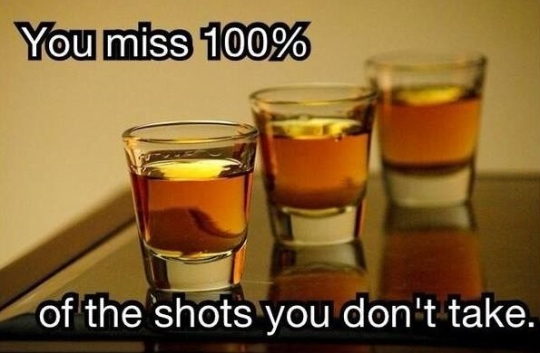

Greetings fellow PhD candidates,

Carnival just passed away, but why stop celebrating?! So in the spirit of celebration we (Hora Est) are hosting a borrel on Friday, the 22nd of March. We would like to invite you all to come join us at the Coffee corner of the Dynamics and Control department for a laid back evening with free drinks some games and fun. We hope to see you all at the borrel. :

Kind Regards,

Hora Est
